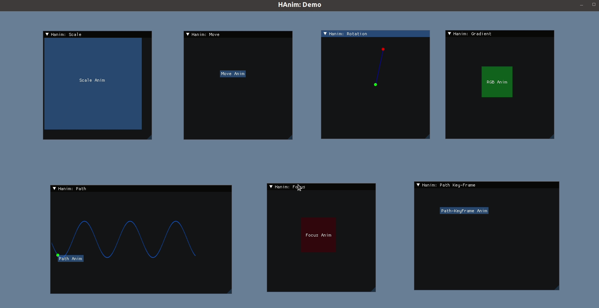
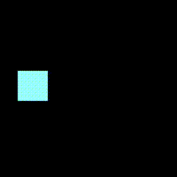
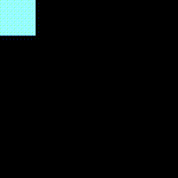
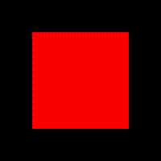
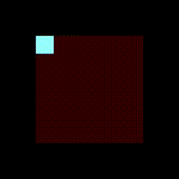
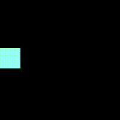
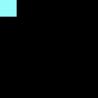
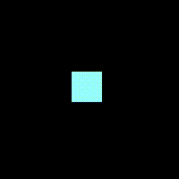
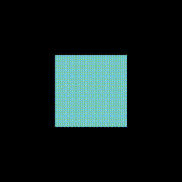

# HAnim (Hi Animation / Hello Animation)

HAnim是一个**帧驱动**, **跨平台**且**动画行为与动画对象分离**的动画框架.

**Animation =  HEngine(HAnimate, HObject)**

<h1></h1>

| 总揽 | 示例/Demo | 文档 | 备注 |
| ------------- | ---- | ---- | ---- |
| [功能特性](#特性/功能) | [基础动画](#基础动画) | 基本用法 |      |
| [用法](#用法) | [组合动画](#组合动画) | [框架设计思想](docs/design-thinking.md) |      |
| [示例](#示例/Demo) |      | 动画设计 |      |
| [Other](#Other) | | 动画对象设计 | |
| | |  | |


## 特性/功能

- **帧驱动**模型, 即适用与**保留模式**GUI库(Qt/其他)也适用于**立即模式**图形/GUI库(opengl/imgui等)
- **动画行为** 与 **动画对象** 解耦, 实现分离设计与开发, 从而提高 设计效率与**复用**可能性

- 支持对象无关的**基础动画**与**组合动画**设计
- 支持作为动画库的框架使用, 也可作为一个**动画中间件**嵌入到一个应用或库
- Header-Only库(需C++ >= 17)


## 用法

### 头文件

- `Hanim.hpp` - 核心框架和基础动画 - 必需
- `HanimAnimate.hpp` - 动画库 - 可选
- `HanimObject.hpp` - 动画对象库 - 可选


### 代码用例

#### HObject-Lambda 动画对象模式

> 通过把移动动画作用到一个HObject的临时对象上, **实现imgui的按钮移动动画**

```cpp
static auto moveAnim = hanim::move(100, 50, 100, 200);
hanim::HEngine::PlayFrame(moveAnim, hanim::HObject(
        [ & ](int type, const hanim::IAFrame &frame) {
            //switch (type) {
                //case hanim::InterpolationAnim::MOVE:
                    ImGui::SetCursorPosX({ frame.data[0] });
                    ImGui::SetCursorPosY({ frame.data[1] });
                    ImGui::Button("Move Anim");
                    //break;
                //default: break;
            //}  
        }
));
```

#### HObject-Impl 动画对象模式

> 通过实现HObject动画对象接口簇, **创建动画对象. **
>
> 把移动动画作用到动画对象上, **实现OpenGL中图形移动动画**

```cpp
class Button : public hanim::HObjectTemplate {
public:
    Button() : HObjectTemplate() {
        _mX = _mY = 0;
        _mW = _mH = 85;
        _mR = 153;
        _mG = _mB = 255;
        _mA = 255;
    }

protected: // interface impl
    void _render() override {

        glColor4f(_mR / 255, _mG / 255, _mB / 255, _mA / 255);
        //glColor3ui((int)_mR, (int)_mG, (int)_mB);

        glBegin(GL_QUADS);

        glVertex2f(_mX, _mY);
        glVertex2f(_mX + _mW, _mY);
        glVertex2f(_mX + _mW, _mY + _mH);
        glVertex2f(_mX, _mY + _mH);

        glEnd();

        glFlush();
    }
};

int main() {
    // opengl init

    auto moveAnim = hanim::move(100, 50, 100, 200);
    Button btn = Button();

    while (flag) {
        // ...
        hanim::HEngine::PlayFrame(moveAnim, btn);
        //...
    }
    // opengl deinit
}
```


## 示例/Demo





---

### 基础动画

> 基础的动画效果及代码实现

<table align = "center">
  <thead>
    <tr>
      <th>动画</th>
      <th>效果</th>
      <th>实现代码</th>
    </tr>
  </thead>
  <body>
    <tr>
      <td>移动</td>
      <td>
        
      </td>
      <td>
        <pre><code>
static hanim::HAnimate::Status move() {
    static auto move = hanim::move(50, 200, 350, 200, 30);
    static auto hobj = hanim::object::opengl::Button();
    hanim::HEngine::PlayFrame(move, hobj);
    return move.status();
}
        </code></pre>
      </td>
    </tr>
    <tr>
      <td>缩放</td>
      <td>
        
      </td>
      <td>
        <pre><code>
static hanim::HAnimate::Status scale() {
    static auto scale = hanim::scale(100, 100, 450, 450, 30);
    static auto hobj = hanim::object::opengl::Button();
    hanim::HEngine::PlayFrame(scale, hobj);
    return scale.status();
}
        </code></pre>
      </td>
    </tr>
    <tr>
      <td>透明度</td>
      <td>
        
      </td>
      <td>
        <pre><code>
static hanim::HAnimate::Status alpha() {
    static auto alpha = hanim::alpha(0, 255, 30);
    static auto hobj = hanim::object::opengl::Button();
    static hanim::HAnimate::Status init = true;
    if (init) {
        hobj.setPos(100, 100);
        hobj.setSize(300, 300);
        init = false;
    }
    hanim::HEngine::PlayFrame(alpha, hobj);
    return alpha.status();
}
        </code></pre>
      </td>
    </tr>
    <tr>
      <td>渐变</td>
      <td>
        
      </td>
      <td>
        <pre><code>
static hanim::HAnimate::Status gradient() {
    static auto gradient = hanim::gradient(255, 0, 0, 0, 0, 255, 30);
    static auto hobj = hanim::object::opengl::Button();
    static hanim::HAnimate::Status init = true;
    if (init) {
        hobj.setPos(100, 100);
        hobj.setSize(300, 300);
        init = false;
    }
    hanim::HEngine::PlayFrame(gradient, hobj);
    return gradient.status();
}
        </code></pre>
      </td>
    </tr>
    <tr>
      <td>旋转</td>
      <td>
        
      </td>
      <td>
        <pre><code>
static hanim::HAnimate::Status rotation() {
    static auto rotation = hanim::rotation(250, 250, 0, 360, 30);
    static auto hobj1 = hanim::object::opengl::Button();
    static auto hobj2 = hanim::object::opengl::Button();
    static hanim::HAnimate::Status init = true;
    if (init) {
        hobj1.setPos(100, 100);
        hobj1.setSize(300, 300);
        hobj1.setColor(255, 0, 0);
        hobj1.setAlpha(50);
        hobj2.setPos(100, 100);
        hobj2.setSize(50, 50);
        init = false;
    }
    hanim::HEngine::PlayFrame(hobj1); // only render
    hanim::HEngine::PlayFrame(rotation, hobj2);
    return rotation.status();
}
        </code></pre>
      </td>
    </tr>
    <tr>
      <td>路径</td>
      <td>
        
      </td>
      <td>
        <pre><code>
static hanim::HAnimate::Status path() {
    static auto path = hanim::path<hanim::InterpolationAnim::Var::X>(
        0, 360, // x from 0 to 360
        [](float x) {
            float radian = x * M_PI / 180;
            return 200 + 100 * std::sin(radian * 2);
        },
        30
    );
    static auto hobj = hanim::object::opengl::Button();
    hanim::HEngine::PlayFrame(path, hobj);
    return path.status();
}
        </code></pre>
      </td>
    </tr>
    <tr>
      <td>帧路径</td>
      <td>
        
      </td>
      <td>
        <pre><code>
static hanim::HAnimate::Status pathKF() {
    static auto path = hanim::path(
        { // path key-frame
            {0, 0},
            {100, 200},
            {300, 300},
            {300, 400},
            {500, 400}
        },
        30
    );
    static auto hobj = hanim::object::opengl::Button();
    hanim::HEngine::PlayFrame(path, hobj);
    return path.status();
}
        </code></pre>
      </td>
    </tr>
  </body>
</table>


### 组合动画

> 使用多个基础动画设计的组合动画

<table align = "center">
  <thead>
    <tr>
      <th>动画</th>
      <th>效果</th>
      <th>"动画"实现</th>
    </tr>
  </thead>
  <body>
    <tr>
      <td>淡入</td>
      <td>
        
      </td>
      <td>
        <pre><code>
struct FadeIn : public ComposeAnim {
    FadeIn(
        int x, int y,
        int frameNumbers = 60,
        std::function<HAnimate&& ()> pathAnimGenFunc = nullptr
    ) {
        if (pathAnimGenFunc) {
            addAnim(pathAnimGenFunc());
        } else {
            ComposeAnim::move(0, y, x, y)
                .setEasingCurve(hanim::EasingCurve::ECType::IN_CUBIC)
                .setFrameNums(frameNumbers);
        }
        ComposeAnim::alpha(0, 255)
            .setEasingCurve(hanim::EasingCurve::ECType::IN_CUBIC)
            .setFrameNums(frameNumbers);
        setFrameNums(frameNumbers);
    }
};
        </code></pre>
      </td>
    </tr>
    <tr>
      <td>淡出</td>
      <td>
        
      </td>
      <td>
        <pre><code>
struct FadeOut : public ComposeAnim {
    FadeOut(
        int x, int y,
        int frameNumbers = 60,
        std::function<HAnimate&& ()> pathAnimGenFunc = nullptr
    ) {
        if (pathAnimGenFunc) {
            addAnim(pathAnimGenFunc());
        } else {
            ComposeAnim::move(x, y, x * 2, y)
                .setEasingCurve(hanim::EasingCurve::ECType::IN_CUBIC)
                .setFrameNums(frameNumbers);
        }
        ComposeAnim::alpha(255, 0)
            .setEasingCurve(hanim::EasingCurve::ECType::IN_CUBIC)
            .setFrameNums(frameNumbers);
        setFrameNums(frameNumbers);
    }
};
        </code></pre>
      </td>
    </tr>
    <tr>
      <td>焦点</td>
      <td>
        
      </td>
      <td>
        <pre><code>
class Focus : public ComposeAnim {
public:
    Focus(int frameNumbers = 60) {
        ComposeAnim::scale(1, 1.1)
            .setEasingCurve(hanim::EasingCurve::OUT_ELASTIC)
            .setFrameNums(frameNumbers);
        ComposeAnim::alpha(200, 255)
            .setEasingCurve(hanim::EasingCurve::ECType::IN_SIN)
            .setFrameNums(frameNumbers);
        this->setFrameNums(frameNumbers);
    }
};
        </code></pre>
      </td>
    </tr>
  </body>
</table>


**注:** 更多Demo及细节, 可参考examples目录对应实现


## Other

- [HAnim](https://github.com/Sunrisepeak/HAnim)
- [Github](https://github.com/Sunrisepeak)