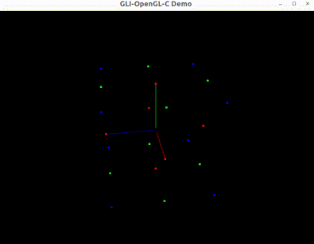

# GLI - GL Interface | WIP

gli是一个迷你的图形库抽象层接口

## 特性

- 接口简单
- 跨平台
- 支持语言
  - C/C++
  - Python
  - Rust

## 示例与演示

<table>
  <tr>
    <td align="center"><b>Examples</b></td>
    <td align="center"><b>Demos</b></td>
  </tr>
  <tr>
    <td align="center">
      
       <b>GLI-空间坐标系</b>
    </td>
    <td align="center">
      
       <b>高考加油</b>
    </td>
  </tr>
</table>